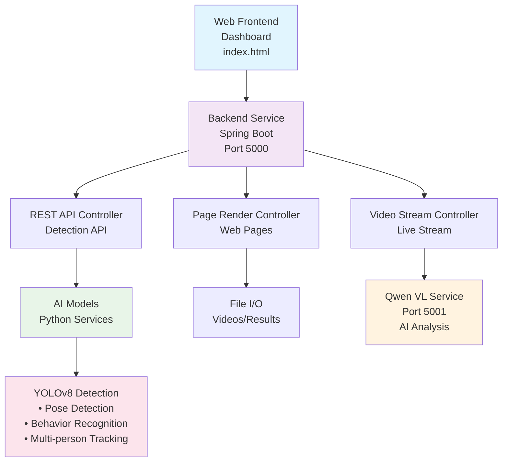

# YOLOv8 Real-Time Security Monitoring System

<div align="center">


A comprehensive real-time security monitoring system based on **YOLOv8** with multi-person pose detection, behavior recognition (falls, fights, fatigue), and AI-powered analysis using **Qwen2.5-VL**.

[Features](#features) • [Quick Start](#quick-start) • [Documentation](#documentation) • [Architecture](#architecture)

</div>

---

## ✨ Features

### 🎯 Core Detection Capabilities
- **Multi-Person Pose Detection** - Simultaneous detection and tracking of multiple people
- **Behavior Recognition**
  - 🔴 Fall Detection - Identify dangerous falls in real-time
  - ⚔️ Fight Detection - Detect altercations and violent behavior
  - 😴 Fatigue Detection - Monitor worker alertness and fatigue
  - 📍 Loitering Detection - Track suspicious loitering behavior

### 🤖 AI Features
- **Qwen2.5-VL Integration** - Advanced visual reasoning and scene understanding
- **Real-time Analysis** - Sub-second processing for live video streams
- **Batch Processing** - Support for multiple video sources simultaneously

### 🔧 Technical Highlights
- **Full Stack Solution** - Backend (Java/Spring Boot) + Frontend (Web) + AI (Python)
- **GPU Acceleration** - Automatic GPU detection and optimization for RTX series
- **Performance Optimized** - Sub-second processing with intelligent resource management
- **RESTful API** - Well-documented REST endpoints for integration
- **Responsive Dashboard** - Real-time monitoring interface with live video, statistics, and alerts

---

## 🚀 Quick Start

### Prerequisites
- **Java** 17 (JDK 17)
- **Anaconda** (with Python 3.10)
- **Git** for version control
- **Maven** 3.6+ (for Java backend)

### 从零开始详细构建步骤

#### 1. 环境准备

**安装Anaconda (推荐包含Python 3.10)**
- 下载Anaconda: https://www.anaconda.com/download
- 选择Python 3.10版本的安装包
- 安装时勾选 "Add Anaconda to PATH"
- 验证安装: `conda --version` 和 `python --version` 应显示 Python 3.10.x

**安装Java 17 (JDK)**
- 下载并安装 JDK 17
- 下载地址: https://adoptium.net/temurin/releases/
- 设置环境变量 `JAVA_HOME` 指向JDK安装目录 (例如: `C:\Program Files\Java\jdk-17`)
- 将 `%JAVA_HOME%\bin` 添加到系统PATH
- 验证安装: `java -version` 应显示 Java 17.x.x

**安装Maven 3.6+ (用于Java后端)**
- 下载Maven: https://maven.apache.org/download.cgi
- 解压到文件夹 (例如: `C:\apache-maven-3.9.5`)
- 设置环境变量 `MAVEN_HOME` 指向Maven目录
- 将 `%MAVEN_HOME%\bin` 添加到PATH
- 验证安装: `mvn -version`

**安装Git**
- 下载并安装 Git: https://git-scm.com/downloads
- 配置用户信息:
```bash
git config --global user.name "Your Name"
git config --global user.email "your.email@example.com"
```

#### 2. 克隆项目
```bash
# 克隆仓库到本地
git clone https://github.com/X-Xcc/EverBright-Security.git
cd EverBright-Security
```

#### 3. 创建Conda环境
```bash
# 创建名为yolov8的conda环境，使用Python 3.10
conda create -n yolov8 python=3.10 -y

# 激活环境
conda activate yolov8

# 验证环境
python --version  # 应显示 Python 3.10.x
```

#### 4. 安装Python依赖
```bash
# 确保在yolov8环境中
conda activate yolov8

# 安装项目依赖
pip install -r requirements.txt

# 验证安装的关键包
python -c "import torch; print('PyTorch版本:', torch.__version__)"
python -c "import ultralytics; print('Ultralytics版本:', ultralytics.__version__)"
python -c "import cv2; print('OpenCV版本:', cv2.__version__)"
python -c "import flask; print('Flask版本:', flask.__version__)"
```

#### 5. 构建Java后端
```bash
# 进入backend目录
cd backend

# 使用Maven构建项目 (需要Java 17)
mvn clean compile

# 打包为WAR文件
mvn clean package

# 返回根目录
cd ..
```

#### 6. 启动服务

**方式一: 使用一键启动脚本 (Windows)**
```bash
# 确保在项目根目录
# 双击运行 start_all.bat 或在命令行运行:
start_all.bat
```

**方式二: 手动启动**

**终端1: 启动后端服务**
```bash
cd backend
java -jar target/yolov8-security.war
# 服务将在 http://localhost:5000/yolov8-security 启动
```

**终端2: 启动Qwen VL服务**
```bash
# 激活conda环境
conda activate yolov8

# 进入ai-models目录
cd ai-models

# 启动服务
python qwen_vl_service.py
# 服务将在 http://localhost:5001 启动
```

**终端3: 启动YOLOv8监控服务**
```bash
# 激活conda环境
conda activate yolov8

# 进入ai-models目录
cd ai-models

# 启动服务
python yolov8_security.py
```

#### 7. 访问系统
- 打开浏览器访问: `http://localhost:5000/yolov8-security`
- 查看实时监控界面

### 同步到GitHub

#### 首次推送代码到GitHub
```bash
# 初始化Git仓库 (如果还没有)
git init

# 添加所有文件
git add .

# 提交更改
git commit -m "Initial commit: YOLOv8 Security Monitoring System"

# 添加远程仓库
git remote add origin https://github.com/YOUR_USERNAME/YOUR_REPO_NAME.git

# 推送代码
git push -u origin main
```

#### 更新代码并推送
```bash
# 添加更改的文件
git add .

# 提交更改
git commit -m "Update: 添加详细构建步骤"

# 推送更改
git push origin main
```

#### 创建新分支并推送
```bash
# 创建新分支
git checkout -b feature/new-feature

# 提交更改
git add .
git commit -m "Add new feature"

# 推送分支
git push origin feature/new-feature
```

### 故障排除

**常见问题:**
- **Conda环境激活失败**: 确保Conda已正确安装并添加到PATH
- **Python依赖安装失败**: 确保在yolov8环境中运行 `conda activate yolov8`
- **Java构建失败**: 确保使用Java 17，运行 `java -version` 检查
- **端口冲突**: 检查5000和5001端口是否被占用
- **GPU不可用**: 如果没有GPU，系统会自动使用CPU模式

**验证安装:**
```bash
# 检查Java
java -version  # 应显示 Java 17.x.x

# 检查Python
conda activate yolov8
python --version  # 应显示 Python 3.10.11

# 检查Conda
conda --version

# 检查Maven
mvn -version

# 检查Git
git --version

# 检查Python包
python -c "import torch, ultralytics, cv2, flask; print('所有包正常')"
```

---

## 📋 System Architecture



---

## 📁 Project Structure

```
yolov8_security/
├── ai-models/                          # AI Model Services
│   ├── yolov8_security.py             # Core detection & behavior recognition
│   ├── qwen_vl_service.py             # Qwen VL API service
│   └── .README
│
├── backend/                            # Java Backend Service
│   ├── config/                         # Spring configurations (CORS, Jackson, Web)
│   ├── controller/                     # REST API endpoints
│   ├── model/                          # Data models
│   ├── service/                        # Business logic
│   ├── application.properties          # Local config
│   ├── application-docker.properties   # Docker config
│   ├── pom.xml                        # Maven configuration
│   └── .README
│
├── frontend/                           # Web Dashboard
│   ├── index.html                     # Real-time monitoring interface
│   └── .README
│
├── docs/                               # Documentation
│   ├── README_JAVA.md                 # Java backend guide
│   ├── README_RUN.md                  # Running & deployment guide
│   ├── Qwen_VL_详细配置指南.md        # Qwen model configuration
│   ├── 部署指南.md                    # Deployment guide
│   └── .README
│
├── models/                             # Pre-trained Models
│   ├── yolov8n-pose.pt                # YOLOv8 nano pose detection model
│   └── .README
│
├── scripts/                            # Automation Scripts
│   ├── start_all.bat                  # Start all services
│   ├── build_war.bat                  # Build WAR package
│   ├── deploy.bat                     # Deploy application
│   └── .README
│
├── requirements.txt                    # Python dependencies
└── README.md                          # This file
```

---

## 🔗 API Endpoints

### Video & Detection API
```
GET  /yolov8-security/api/video/stream     # Video stream endpoint
GET  /yolov8-security/api/detection/latest # Get latest detections
GET  /yolov8-security/api/stats            # Get system statistics
POST /yolov8-security/api/detection/save   # Save detection data
```

### Qwen VL API
```
POST /analyze                # Analyze base64 encoded image
POST /analyze_file          # Analyze uploaded image file
POST /batch_analyze         # Batch analyze multiple images
GET  /health               # Service health check
```

### Dashboard
```
http://localhost:8080/yolov8-security
http://localhost:5000              # Docker deployment
```

---

## 📚 Documentation

Detailed documentation available in the `docs/` folder:

- **[Java Backend Guide](docs/README_JAVA.md)** - Backend architecture and development
- **[Running & Deployment](docs/README_RUN.md)** - How to run and deploy the system
- **[Qwen Model Configuration](docs/Qwen_VL_详细配置指南.md)** - Detailed Qwen setup
- **[Deployment Guide](docs/部署指南.md)** - Step-by-step deployment instructions

Each module also has a `.README` file with specific implementation details.

---

## 🐳 Docker Deployment

Build and run with Docker:

```bash
# Build the backend
cd backend
mvn clean package -DskipTests

# Build Docker image
docker build -t yolov8-security .

# Run container
docker run -p 5000:5000 -p 5001:5001 \
  -e QWEN_VL_MODEL_PATH=/app/models \
  yolov8-security
```

---

## 📊 Performance Metrics

### Hardware Acceleration
- **GPU Support**: NVIDIA RTX 30/40 series (CUDA 12.1+)
- **CPU Fallback**: Optimized for Intel/AMD processors
- **Auto Detection**: Automatic hardware optimization

### Detection Speed
- **GPU Mode**: ~15-25ms per frame (YOLOv8 Nano on RTX 40-series)
- **CPU Mode**: ~50-80ms per frame (optimized configuration)
- **Supported Resolution**: 416x416 to 1920x1080
- **FPS**: 15-60 FPS (depending on model and hardware)

### Resource Usage
- **GPU Memory**: ~500MB (YOLOv8n-pose) + ~2GB (batch processing)
- **CPU Memory**: ~1-2GB (with optimization)
- **Concurrent Users**: 10+ simultaneous viewers

---

## 🛠️ Technology Stack

| Component | Technology | Purpose |
|-----------|-----------|---------|
| **Backend** | Spring Boot, Java 17+ | REST API, Service orchestration |
| **Frontend** | HTML5, CSS3, JavaScript | Real-time dashboard |
| **AI/ML** | YOLOv8, PyTorch, Transformers | Object detection & behavior recognition |
| **Vision AI** | Qwen2.5-VL | Advanced scene understanding |
| **Build** | Maven | Java project build |
| **Runtime** | Docker | Containerization |

---

## 🤝 Contributing

Contributions are welcome! Please follow these steps:

1. Fork the repository
2. Create a feature branch (`git checkout -b feature/AmazingFeature`)
3. Commit changes (`git commit -m 'Add AmazingFeature'`)
4. Push to branch (`git push origin feature/AmazingFeature`)
5. Open a Pull Request

---

## 📝 License

This project is licensed under the MIT License - see the [LICENSE](LICENSE) file for details.

---

## � Troubleshooting

### Performance Issues
- **Slow Detection**: Check GPU utilization with `nvidia-smi`
- **High CPU Usage**: Ensure CUDA drivers are installed
- **Memory Errors**: Reduce batch size or image resolution

### GPU Not Detected
```bash
# Check CUDA installation
python -c "import torch; print(torch.cuda.is_available())"

# Install CUDA PyTorch
pip install torch torchvision torchaudio --index-url https://download.pytorch.org/whl/cu124
```

### Common Fixes
- Update NVIDIA drivers to latest version
- Install CUDA 12.1+ toolkit
- Use Python 3.8-3.11 for best compatibility

See [PERFORMANCE_OPTIMIZATION.md](PERFORMANCE_OPTIMIZATION.md) for detailed optimization guide.

---

## 🌟 Acknowledgments

- [YOLOv8](https://github.com/ultralytics/yolov8) - Object detection framework
- [Qwen](https://github.com/QwenLM/Qwen2.5-VL) - Vision-language model
- [Spring Boot](https://spring.io/projects/spring-boot) - Java framework
- [PyTorch](https://pytorch.org/) - Deep learning framework

---

<div align="center">

Made with ❤️ by X-Xcc

[⭐ Star on GitHub](https://github.com/X-Xcc/EverBright-Security)

</div>
