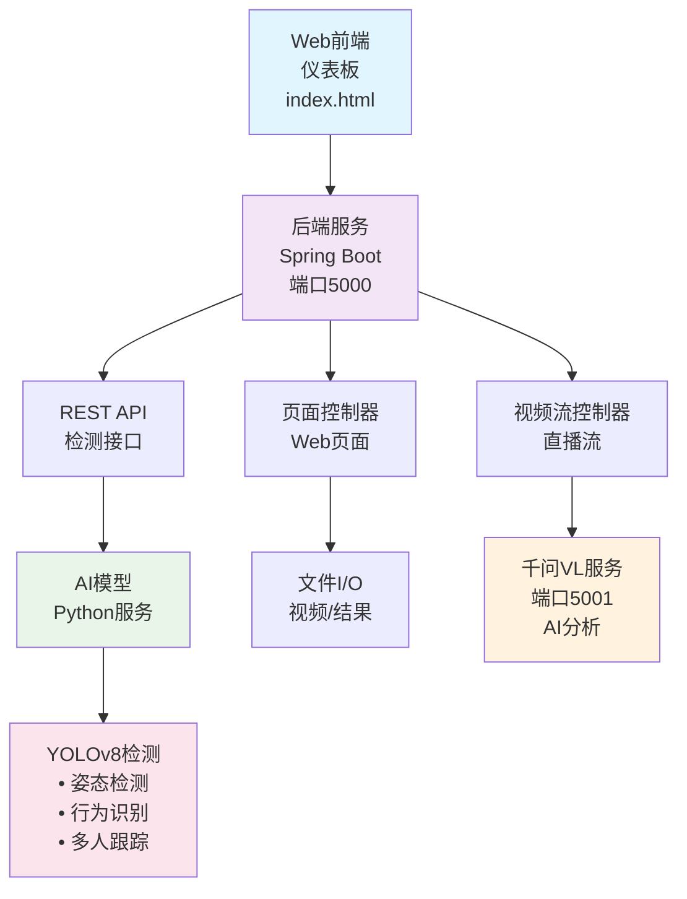

# 🚨 重要提示：首次使用前请同步最新代码

**⚠️ 小白用户必读：每次使用项目前，请先运行以下命令同步最新代码！**

```bash
# 进入项目目录
cd D:\yolov8_security

# 拉取最新代码（重要！）
git pull origin main

# 如果有冲突，强制覆盖本地更改
git reset --hard origin/main
git pull origin main
```

**为什么需要这样做？**
- 项目会不定期更新，修复bug和添加新功能
- 确保你使用的是最新版本
- 避免版本不一致导致的问题

---

# YOLOv8 Real-Time Security Monitoring System

<div align="center">


A comprehensive real-time security monitoring system based on **YOLOv8** with multi-person pose detection, behavior recognition (falls, fights, fatigue), and AI-powered analysis using **Qwen2.5-VL**.

[快速开始](#-快速开始) • [详细部署](#-详细部署指南) • [故障排除](#-故障排除)

</div>

---

## ✨ 系统功能

### 🎯 核心检测能力
- **多人姿态检测** - 同时检测和跟踪多人
- **行为识别**
  - 🔴 跌倒检测 - 实时识别危险跌倒
  - ⚔️ 打斗检测 - 检测打斗和暴力行为
  - 😴 疲劳检测 - 监测工人疲劳状态
  - 📍 徘徊检测 - 跟踪可疑徘徊行为

### 🤖 AI功能
- **千问VL集成** - 先进的视觉推理和场景理解
- **实时分析** - 亚秒级处理直播视频流
- **批量处理** - 支持同时处理多个视频源

### 🔧 技术亮点
- **全栈解决方案** - 后端(Java/Spring Boot) + 前端(Web) + AI(Python)
- **GPU加速** - 自动GPU检测和RTX系列优化
- **性能优化** - 亚秒级处理和智能资源管理
- **RESTful API** - 完善的REST端点用于集成
- **响应式仪表板** - 实时监控界面，包含直播视频、统计和警报

---

## 🚀 快速开始

### 系统要求
- **操作系统**: Windows 10/11
- **Java**: JDK 17
- **Python**: 3.10 (通过Anaconda)
- **Git**: 用于代码管理

### 一键启动 (推荐)
```bash
# 确保所有环境已安装
# 双击运行 start_all.bat 文件
# 或在命令行运行:
start_all.bat
```

### 手动启动
1. **启动后端服务** (新命令窗口):
   ```bash
   cd backend
   java -jar target/yolov8-security.war
   ```

2. **启动AI检测服务** (新命令窗口):
   ```bash
   conda activate yolov8
   cd ai-models
   python yolov8_security.py
   ```

3. **访问系统**:
   - 打开浏览器访问: `http://localhost:5000/yolov8-security`

---

## 📋 详细部署指南

### 步骤1: 环境准备

#### 安装Anaconda (Python环境)
```bash
# 下载并安装Anaconda
# 下载地址: https://www.anaconda.com/download
# 安装到: D:\Anaconda3
# 安装时勾选 "Add Anaconda to PATH"
```

#### 安装Java 17 (JDK)

**推荐方式：使用命令行安装 (winget - Windows 10/11内置)**
```powershell
# 以管理员身份打开PowerShell，运行以下命令：
winget install --id EclipseAdoptium.Temurin.17.JDK --version 17.0.10.7 -e

# 验证安装
java -version
```

**备选方式：使用清华大学镜像源 (国内用户推荐，更快)**
```powershell
# 以管理员身份打开PowerShell，运行以下命令：

# 首先添加清华大学镜像源
winget source add -n tuna https://mirrors.tuna.tsinghua.edu.cn/winget/

# 安装Java 17
winget install --id EclipseAdoptium.Temurin.17.JDK --version 17.0.10.7 -e --source tuna

# 验证安装
java -version
```

**手动下载安装 (最后备选)**
- 下载并安装 JDK 17
- 下载地址: https://adoptium.net/temurin/releases/
- 安装到: `D:\Java\jdk-17` (自定义安装路径时选择此目录)
- 设置环境变量 `JAVA_HOME` 指向JDK安装目录 (例如: `D:\Java\jdk-17`)
- 将 `%JAVA_HOME%\bin` 添加到系统PATH
- 验证安装: `java -version` 应显示 Java 17.x.x

#### 安装Maven 3.6+ (用于Java后端)

**推荐方式：使用命令行安装 (winget)**
```powershell
# 以管理员身份打开PowerShell，运行以下命令：
winget install --id Apache.Maven -e

# 验证安装
mvn -version
```

**备选方式：使用清华大学镜像源 (国内用户推荐，更快)**
```powershell
# 以管理员身份打开PowerShell，运行以下命令：

# 如果还没添加源，先添加清华大学镜像源
winget source add -n tuna https://mirrors.tuna.tsinghua.edu.cn/winget/

# 安装Maven
winget install --id Apache.Maven -e --source tuna

# 验证安装
mvn -version
```

**手动下载安装 (最后备选)**
- 下载Maven: https://maven.apache.org/download.cgi
- 解压到文件夹: `D:\apache-maven-3.9.5`
- 设置环境变量 `MAVEN_HOME` 指向Maven目录 (例如: `D:\apache-maven-3.9.5`)
- 将 `%MAVEN_HOME%\bin` 添加到PATH
- 验证安装: `mvn -version`

#### 安装Git

**推荐方式：使用命令行安装 (winget)**
```powershell
# 以管理员身份打开PowerShell，运行以下命令：
winget install --id Git.Git -e

# 配置用户信息
git config --global user.name "Your Name"
git config --global user.email "your.email@example.com"

# 验证安装
git --version
```

**备选方式：使用清华大学镜像源 (国内用户推荐，更快)**
```powershell
# 以管理员身份打开PowerShell，运行以下命令：

# 如果还没添加源，先添加清华大学镜像源
winget source add -n tuna https://mirrors.tuna.tsinghua.edu.cn/winget/

# 安装Git
winget install --id Git.Git -e --source tuna

# 配置用户信息
git config --global user.name "Your Name"
git config --global user.email "your.email@example.com"

# 验证安装
git --version
```

**手动下载安装 (最后备选)**
- 下载并安装 Git: https://git-scm.com/downloads
- 安装到: `D:\Git` (自定义安装路径时选择此目录)
- 配置用户信息:
```bash
git config --global user.name "Your Name"
git config --global user.email "your.email@example.com"
```

### 步骤2: 获取项目代码

```bash
# 克隆项目到本地
git clone https://github.com/X-Xcc/EverBright.git
cd yolov8_security
```

### 步骤3: 配置Python环境

```bash
# 创建Conda环境
conda create -n yolov8 python=3.10 -y

# 激活环境
conda activate yolov8

# 安装Python依赖
pip install -r requirements.txt

# 验证安装
python -c "import torch; print('PyTorch版本:', torch.__version__)"
python -c "import ultralytics; print('Ultralytics版本:', ultralytics.__version__)"
```

### 步骤4: 构建Java后端

```bash
# 进入backend目录
cd backend

# 构建项目
mvn clean compile

# 打包
mvn clean package

# 返回根目录
cd ..
```

### 步骤5: 启动系统

#### 方式一: 一键启动 (推荐)
```bash
# 双击运行 start_all.bat
# 或命令行运行:
start_all.bat
```

#### 方式二: 手动启动

**终端1: 启动后端服务**
```bash
cd backend
java -jar target/yolov8-security.war
```

**终端2: 启动AI检测服务**
```bash
conda activate yolov8
cd ai-models
python yolov8_security.py
```

**终端3: 启动千问VL服务 (可选)**
```bash
conda activate yolov8
cd ai-models
python qwen_vl_service.py
```

### 步骤6: 访问系统
- 打开浏览器访问: `http://localhost:5000/yolov8-security`
- 开始实时监控！

---

## 🔧 故障排除

### 常见问题

**Java安装问题**
```bash
# 检查Java版本
java -version
# 应显示: Java 17.x.x
```

**Python环境问题**
```bash
# 激活环境
conda activate yolov8

# 检查Python版本
python --version
# 应显示: Python 3.10.x
```

**依赖安装失败**
```bash
# 重新安装依赖
pip install -r requirements.txt --force-reinstall
```

**后端启动失败**
```bash
# 检查端口是否被占用
netstat -ano | findstr :5000

# 如果被占用，杀掉进程或换端口
```

**AI服务启动失败**
```bash
# 检查GPU
python -c "import torch; print(torch.cuda.is_available())"

# 如果没有GPU，系统会自动使用CPU
```

### 验证安装

```bash
# 检查所有组件
java -version          # Java 17+
conda --version        # Conda
mvn -version          # Maven
git --version         # Git

# 检查Python包
conda activate yolov8
python -c "import torch, ultralytics, cv2, flask; print('✅ 所有包正常')"
```

---

## 📊 系统架构



---

## 📁 项目结构

```
yolov8_security/
├── ai-models/              # AI模型服务
│   ├── yolov8_security.py # 核心检测和行为识别
│   ├── qwen_vl_service.py # 千问VL API服务
│   └── gpu_test.py        # GPU测试
├── backend/                # Java后端服务
│   ├── src/               # 源代码
│   ├── pom.xml           # Maven配置
│   └── target/           # 编译输出
├── frontend/              # Web仪表板
│   └── index.html        # 实时监控界面
├── models/                # 预训练模型
├── scripts/               # 自动化脚本
├── requirements.txt       # Python依赖
└── README.md             # 项目文档
```

---

## 🔗 API接口

### 视频检测API
```
GET  /yolov8-security/api/video/stream     # 视频流端点
GET  /yolov8-security/api/detection/latest # 获取最新检测结果
GET  /yolov8-security/api/stats            # 获取系统统计
POST /yolov8-security/api/detection/save   # 保存检测数据
```

### 千问VL API
```
POST /analyze                # 分析base64编码图片
POST /analyze_file          # 分析上传的图片文件
POST /batch_analyze         # 批量分析多个图片
GET  /health               # 服务健康检查
```

### 仪表板
```
http://localhost:5000/yolov8-security
```

---

## 📚 文档

docs/ 文件夹包含详细文档：

- **[Java后端指南](docs/README_JAVA.md)** - 后端架构和开发
- **[运行部署指南](docs/README_RUN.md)** - 运行和部署说明
- **[千问模型配置](docs/Qwen_VL_详细配置指南.md)** - 千问设置详细说明
- **[部署指南](docs/部署指南.md)** - 一步步部署说明

每个模块都有 .README 文件，包含具体实现细节。

---

## 📊 性能指标

### 硬件加速
- **GPU支持**: NVIDIA RTX 30/40系列 (CUDA 12.1+)
- **CPU回退**: 针对Intel/AMD处理器优化
- **自动检测**: 自动硬件优化

### 检测速度
- **GPU模式**: RTX 40系列上 ~15-25ms每帧
- **CPU模式**: ~50-80ms每帧 (优化配置)
- **支持分辨率**: 416x416 到 1920x1080
- **FPS**: 15-60 FPS (取决于模型和硬件)

### 资源使用
- **GPU内存**: YOLOv8n-pose ~500MB + 批量处理 ~2GB
- **CPU内存**: ~1-2GB (优化后)
- **并发用户**: 10+ 同时查看者

---

## 🛠️ 技术栈

| 组件 | 技术 | 用途 |
|------|------|------|
| **后端** | Spring Boot, Java 17+ | REST API, 服务编排 |
| **前端** | HTML5, CSS3, JavaScript | 实时仪表板 |
| **AI/ML** | YOLOv8, PyTorch, Transformers | 对象检测和行为识别 |
| **视觉AI** | Qwen2.5-VL | 高级场景理解 |
| **构建** | Maven | Java项目构建 |
| **运行时** | Windows | 本机运行 |

---

## 🤝 贡献指南

欢迎贡献代码！

1. Fork 本仓库
2. 创建特性分支 (`git checkout -b feature/AmazingFeature`)
3. 提交更改 (`git commit -m 'Add AmazingFeature'`)
4. 推送到分支 (`git push origin feature/AmazingFeature`)
5. 开启 Pull Request

---

## 📝 许可证

本项目采用 MIT 许可证 - 查看 [LICENSE](LICENSE) 文件了解详情。

---

## 🌟 致谢

- [YOLOv8](https://github.com/ultralytics/yolov8) - 对象检测框架
- [Qwen](https://github.com/QwenLM/Qwen2.5-VL) - 视觉语言模型
- [Spring Boot](https://spring.io/projects/spring-boot) - Java框架
- [PyTorch](https://pytorch.org/) - 深度学习框架

---

<div align="center">

Made with ❤️ by X-Xcc

[⭐ 在GitHub上加星](https://github.com/X-Xcc/EverBright)

</div>