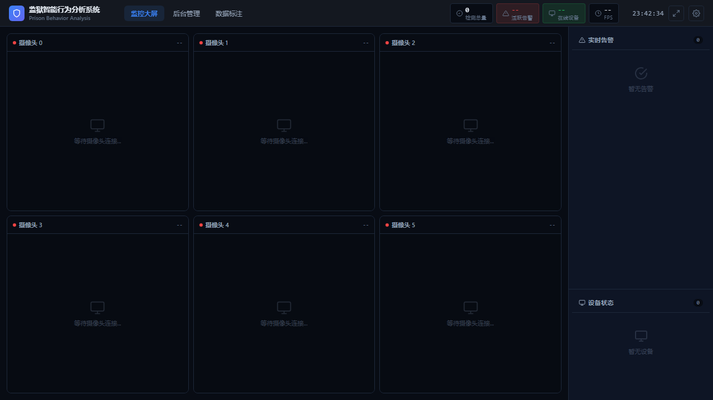
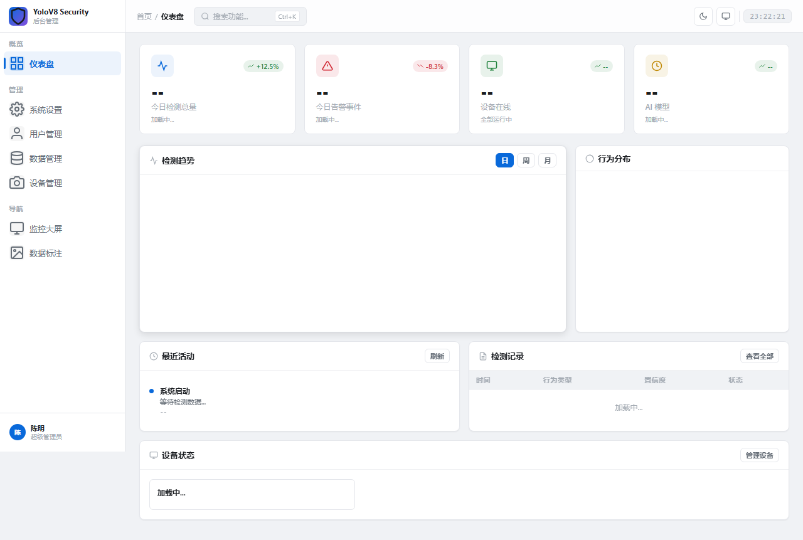
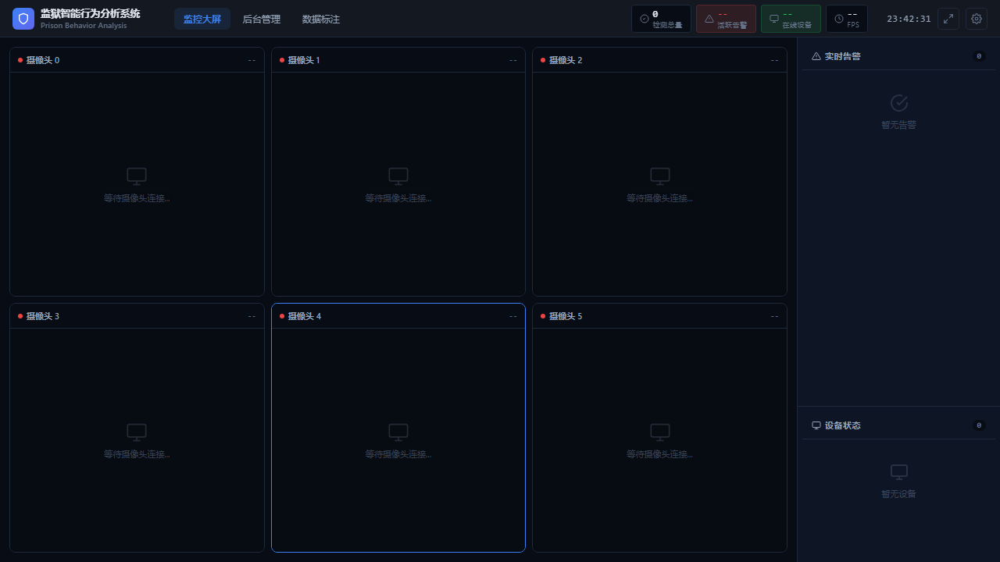

# 监狱智能行为分析系统

> 一个给监狱/看守所使用的 AI 视频监控系统，可以自动检测异常行为并报警。

本系统通过摄像头实时监控画面，利用 AI 自动识别**跌倒、打架、疲劳瞌睡、人员离岗、人群聚集**等异常行为，并在电脑屏幕上显示报警信息。同时提供 Web 网页管理面板，方便远程查看监控画面和数据统计。

---

## 目录

- [这个系统能做什么](#这个系统能做什么)
- [系统界面](#系统界面)
- [运行原理（简单版）](#运行原理简单版)
- [你需要准备什么](#你需要准备什么)
- [国内镜像源配置（必看）](#国内镜像源配置必看)
- [一步步教你运行](#一步步教你运行)
  - [第 1 步：下载 YOLOv8 模型文件](#第-1-步下载-yolov8-模型文件)
  - [第 2 步：安装 Python 环境](#第-2-步安装-python-环境)
  - [第 3 步：运行 Python AI 检测程序](#第-3-步运行-python-ai-检测程序)
  - [第 4 步：安装 Java 并启动后端（可选）](#第-4-步安装-java-并启动后端可选)
- [打开网页管理面板](#打开网页管理面板)
- [常见问题（FAQ）](#常见问题faq)
- [目录结构说明](#目录结构说明)
- [高级设置](#高级设置)
- [部署到服务器](#部署到服务器)

---

## 这个系统能做什么

| 功能 | 说明 |
|------|------|
|  **跌倒检测** | 老人或犯人摔倒时自动报警 |
|  **打架检测** | 检测到两人以上激烈肢体接触时报警 |
|  **疲劳检测** | 检测到人长时间不动（可能在打瞌睡）时提醒；也能检测闭眼疲劳 |
|  **离岗检测** | 监控区域内长时间没人时报警 |
|  **人员聚集** | 检测到 3 人以上聚在一起超过 3 秒时提醒 |
|  **桌面端界面** | 运行 Python 程序后弹出一个窗口，实时显示检测画面 |
|  **Web 管理面板** | 浏览器打开网页，可查看实时视频流、统计图表、历史截图 |

---

## 系统界面

### 桌面端（OpenCV 窗口）

运行 Python 程序后，会弹出一个名为 "Security Detection System" 的窗口：
- 左侧是状态面板，显示当前人数、检测到的行为、最近日志
- 主画面中，人体会被框出来，异常行为会标红
- 顶部有 LIVE 状态灯（正常绿色、报警红色）
- 右上角显示实时 FPS（每秒处理帧数）



### Web 管理面板

浏览器打开后可以看到：
- 实时监控视频流（MJPEG 格式）
- 行为统计柱状图/折线图
- 历史截图浏览
- 一键删除所有截图数据

 

---

## 运行原理（简单版）

```
摄像头/视频文件 ──→ Python AI 检测程序 ──→ 在屏幕上显示检测结果
                        │
                        ├──→ 把检测结果保存为 JSON 文件
                        ├──→ 把截图保存为 JPG 图片
                        └──→ 把视频画面发送给 Java 后端

Java 后端 ──→ 读取 JSON 和图片 ──→ 提供网页 API ──→ 浏览器展示
```

简单说：**Python 负责 AI 检测**，**Java 负责网页服务**，两者通过文件 + 网络通信。

---

## 你需要准备什么

### 基础要求

| 项目 | 要求 |
|------|------|
| 操作系统 | Windows 10/11、Linux、macOS |
| Python | 3.8 ~ 3.11（**推荐 3.10**） |
| Java | JDK 17 或更高版本 |
| 内存 | 至少 4GB（推荐 8GB+） |
| 硬盘 | 至少 2GB 可用空间 |
| 显卡 | 有 NVIDIA 显卡可加速（没有也能用，只是慢一点） |

### 没有摄像头怎么办？

系统默认使用摄像头。如果没有摄像头，可以改成播放视频文件：
1. 打开 `detection/yolov8_security.py`
2. 找到 `SOURCE = 0` 这一行（约第 64 行附近）
3. 改成 `SOURCE = "videos/test_video.mp4"`（把视频文件放在 `videos/` 文件夹里）
4. 如果没有视频文件，程序会自动创建一个测试画面

---

## 国内镜像源配置（必看）

> 以下所有下载命令已经换成国内镜像源，速度比默认快很多。**先配好再装依赖**。

### 1. pip 镜像（Python 包下载加速）

**临时使用（每次安装时加参数）：**
```bash
pip install <包名> -i https://pypi.tuna.tsinghua.edu.cn/simple
```

**永久设置（配一次就行）：**
```bash
pip config set global.index-url https://pypi.tuna.tsinghua.edu.cn/simple
```

### 2. npm 镜像（Node.js 包下载加速）

```bash
npm config set registry https://registry.npmmirror.com
```

### 3. conda 镜像（Anaconda/Miniconda 加速）

如果你用 conda 管理环境，配置以下镜像：
```bash
conda config --add channels https://mirrors.tuna.tsinghua.edu.cn/anaconda/pkgs/main
conda config --add channels https://mirrors.tuna.tsinghua.edu.cn/anaconda/pkgs/free
conda config --set show_channel_urls yes
```

### 4. GitHub 文件下载加速

国内访问 GitHub 很慢，以下代理可以加速下载：

| 代理服务 | 用法 |
|---------|------|
| ghfast.top | 把 GitHub 链接前面加上 `https://ghfast.top/` |
| gh-proxy.com | 把 GitHub 链接前面加上 `https://gh-proxy.com/` |

**示例：** 下载 YOLOv8 模型（见下方第 1 步）

### 5. PyTorch CUDA 加速（有 NVIDIA 显卡时）

> **没有 NVIDIA 显卡？** 直接 `pip install torch torchvision` 就行，不用管 CUDA，从清华 pip 镜像装即可。

默认 `pip install torch`（配合清华 pip 镜像）会自动安装 CUDA 版本，大多数场景够用。

如果你需要**指定 CUDA 版本**，用以下命令：

```bash
# CUDA 11.8
pip install torch torchvision torchaudio --index-url https://download.pytorch.org/whl/cu118

# CUDA 12.4（推荐，兼容性好）
pip install torch torchvision torchaudio --index-url https://download.pytorch.org/whl/cu124

# CUDA 12.6
pip install torch torchvision torchaudio --index-url https://download.pytorch.org/whl/cu126
```

> **注意：** 以上 `--index-url` 指向 PyTorch 官方源，国内可能较慢。如果很慢，可以试上海交大镜像（但版本可能较旧）：
> ```bash
> pip install torch torchvision torchaudio --index-url https://mirror.sjtu.edu.cn/pytorch-wheels/
> ```

---

## 一步步教你运行

### 第 1 步：下载 YOLOv8 模型文件

系统需要一个 AI 模型文件才能工作。`yolov8n-pose.pt`（约 6.5MB）。

> **注意：** 本仓库 `models/` 目录下已经包含了此文件。如果你是通过 `git clone` 下载的仓库，跳过这一步。

如果你需要单独下载，选择以下任一方式：

**方式 A：GitHub 代理下载（推荐，国内快）**
```bash
# 方式 1：ghfast.top
curl -L -o models/yolov8n-pose.pt "https://ghfast.top/https://github.com/ultralytics/assets/releases/download/v8.2.0/yolov8n-pose.pt"

# 方式 2：gh-proxy.com（如果方式 1 不通）
curl -L -o models/yolov8n-pose.pt "https://gh-proxy.com/https://github.com/ultralytics/assets/releases/download/v8.2.0/yolov8n-pose.pt"
```

**方式 B：直接下载（需要能访问 GitHub）**
```bash
curl -L -o models/yolov8n-pose.pt "https://github.com/ultralytics/assets/releases/download/v8.2.0/yolov8n-pose.pt"
```

**方式 C：浏览器手动下载**
1. 在浏览器中打开以下地址（选一个能打开的）：
   - `https://ghfast.top/https://github.com/ultralytics/assets/releases/download/v8.2.0/yolov8n-pose.pt`
   - `https://github.com/ultralytics/assets/releases/download/v8.2.0/yolov8n-pose.pt`
2. 下载完成后，把文件放到项目的 `models/` 文件夹里

> 如果 `models/` 文件夹不存在，手动创建一个。

### 第 2 步：安装 Python 环境

#### 方式 A：用 conda（推荐，环境隔离好）

**先安装 Miniconda（国内镜像）：**

下载地址：`https://mirrors.tuna.tsinghua.edu.cn/anaconda/miniconda/`

找到 `Miniconda3-latest-Windows-x86_64.exe`（Windows）或 `Miniconda3-latest-Linux-x86_64.sh`（Linux）下载安装。安装后记得按上面配置 conda 镜像源，否则 `conda install` 还是会从国外下载。

**创建环境：**
```bash
# 用项目提供的环境配置文件创建环境
conda env create -f environment.yml

# 激活环境
conda activate yolov8-security
```

如果没有 `environment.yml`，手动创建：
```bash
conda create -n yolov8-security python=3.10 -y
conda activate yolov8-security
```

#### 方式 B：用 pip（简单直接）

```bash
# 先确保 pip 镜像已配置（见上面"国内镜像源配置"部分）
pip config set global.index-url https://pypi.tuna.tsinghua.edu.cn/simple

# 安装依赖
pip install -r detection/requirements.txt
```

如果 `requirements.txt` 不存在或安装失败，手动安装核心依赖：
```bash
pip install ultralytics opencv-python numpy pillow requests flask flask-cors -i https://pypi.tuna.tsinghua.edu.cn/simple
```

> **PyTorch 安装：** 上面的命令会自动安装 PyTorch。如果你有 NVIDIA 显卡想用 GPU 加速，见上方 [PyTorch CUDA 加速](#5-pytorch-cuda-加速有-nvidia-显卡时) 部分。

**验证安装是否成功：**
```bash
python -c "import ultralytics; print('ultralytics OK')"
python -c "import cv2; print('opencv OK')"
python -c "import torch; print('PyTorch', torch.__version__); print('CUDA:', torch.cuda.is_available())"
```

看到输出没有报错就说明装好了。最后一条会告诉你 CUDA 是否可用。

### 第 3 步：运行 Python AI 检测程序

```bash
# 进入 AI 模型目录
cd detection

# 运行检测程序
python yolov8_security.py
```

如果一切正常，会弹出一个窗口，显示摄像头画面，并实时检测人体和行为。

> **注意：** 程序默认调用摄像头（设备 0）。如果你的摄像头是笔记本自带摄像头，通常就是 0。如果是外接摄像头，可能需要改成 1 或 2。没有摄像头的话改成视频文件路径，见上方 [没有摄像头怎么办](#没有摄像头怎么办)。

### 第 4 步：安装 Java 并启动后端（可选）

> 如果你只想看桌面端的检测画面，不需要 Web 管理面板，可以跳过这一步。

**安装 JDK 17（国内镜像）：**

方式 A：华为云 OpenJDK（推荐，稳定）：
- Windows：`https://mirrors.huaweicloud.com/openjdk/17/openjdk-17_windows-x64_bin.zip`
- Linux：`https://mirrors.huaweicloud.com/openjdk/17/openjdk-17_linux-x64_bin.tar.gz`

方式 B：清华大学 Adoptium 镜像（如果浏览器打不开，用 wget/curl 下载）：
- Windows：`https://mirrors.tuna.tsinghua.edu.cn/Adoptium/17/jdk/x64/windows/`
- Linux：`https://mirrors.tuna.tsinghua.edu.cn/Adoptium/17/jdk/x64/linux/`

```bash
# Linux 用 wget 下载清华镜像（浏览器打不开时用这个）
wget https://mirrors.tuna.tsinghua.edu.cn/Adoptium/17/jdk/x64/linux/OpenJDK17U-jdk_x64_linux_hotspot_17.0.19_10.tar.gz
```

下载后解压安装即可。华为云是 OpenJDK 原版，清华镜像是 Adoptium (Temurin) 版，功能上没区别。

**验证安装：**
```bash
java -version
# 应该显示类似 "openjdk version "17.0.x" 的信息
```

如果显示"不是内部命令"，说明环境变量没配好。把 JDK 的 `bin` 目录加到系统 PATH 里。

**构建并运行后端：**
```bash
# 进入 server 目录
cd server

# 构建项目（第一次运行需要下载 Maven 依赖，国内比较慢）
# Maven 镜像（推荐）：
./mvnw clean package -DskipTests

# 如果 mvnw 很慢，可以设置 Maven 镜像：
# 编辑 ~/.m2/settings.xml，添加阿里云镜像（见下方）

# 启动后端服务
./mvnw spring-boot:run
```

看到类似 `Tomcat started on port(s): 5000` 的日志，说明启动成功。

> **Windows 提示：** 如果 `./mvnw` 报错，请用 `mvnw.cmd` 代替，例如 `mvnw.cmd clean package -DskipTests`

**Maven 阿里云镜像（加速依赖下载）：**

在用户目录下创建 `~/.m2/settings.xml`（Windows 是 `C:\Users\你的用户名\.m2\settings.xml`），内容如下：

```xml
<settings>
  <mirrors>
    <mirror>
      <id>aliyunmaven</id>
      <mirrorOf>*</mirrorOf>
      <name>阿里云公共仓库</name>
      <url>https://maven.aliyun.com/repository/public</url>
    </mirror>
  </mirrors>
</settings>
```

---

## 打开网页管理面板

当 Java 后端启动成功后，打开浏览器访问：

```
http://localhost:5000/yolov8-security/
```

Web 面板包含：
- **实时监控** — 查看摄像头实时画面（MJPEG 视频流）
- **统计图表** — 各类行为的发生次数统计
- **历史截图** — 查看 AI 检测到异常时自动保存的截图
- **数据管理** — 一键清理所有截图和检测数据

---

## 常见问题（FAQ）

### Q：程序提示 "CUDA 不可用" / "使用 CPU"

这是正常的。CUDA 需要 NVIDIA 独立显卡，如果没有 NVIDIA 显卡，程序会自动使用 CPU 运行，速度会慢一些，但功能完全一样。如果用的是 NVIDIA 显卡，需要安装 CUDA 工具包来加速。参考上方 [PyTorch CUDA 加速](#5-pytorch-cuda-加速有-nvidia-显卡时) 部分。

### Q：弹出窗口但看不到画面

摄像头可能被其他程序占用了（如微信、Zoom、腾讯会议等）。关闭其他使用摄像头的程序，重新运行。

### Q：报错 "ModuleNotFoundError: No module named 'ultralytics'"

依赖没装全。重新运行：
```bash
pip install ultralytics opencv-python numpy pillow requests flask flask-cors -i https://pypi.tuna.tsinghua.edu.cn/simple
```

### Q：pip install 报错 / 超时

确认已经配置了 pip 镜像源：
```bash
pip config set global.index-url https://pypi.tuna.tsinghua.edu.cn/simple
```

如果还是超时，可以加上 `--trusted-host`：
```bash
pip install <包名> -i https://pypi.tuna.tsinghua.edu.cn/simple --trusted-host pypi.tuna.tsinghua.edu.cn
```

### Q：Web 面板打不开

1. 确认 Java 后端已经启动成功。检查命令行是否显示了 `Tomcat started on port(s): 5000`
2. 确认浏览器地址是 `http://localhost:5000/yolov8-security/`（注意末尾的斜杠）
3. 检查端口 5000 是否被其他程序占用

### Q：画面很卡怎么办？

可以降低画质来提高速度。打开 `detection/yolov8_security.py`，找到 `Config` 类，把 `IMG_SIZE = 512` 改成 `IMG_SIZE = 320`（数字越小越快，但精度会降低）。

### Q：Maven 下载依赖很慢

配置阿里云 Maven 镜像。在 `~/.m2/settings.xml` 中添加：
```xml
<mirror>
  <id>aliyunmaven</id>
  <mirrorOf>*</mirrorOf>
  <url>https://maven.aliyun.com/repository/public</url>
</mirror>
```

### Q：conda install / create 很慢

配置 conda 镜像：
```bash
conda config --add channels https://mirrors.tuna.tsinghua.edu.cn/anaconda/pkgs/main
conda config --add channels https://mirrors.tuna.tsinghua.edu.cn/anaconda/pkgs/free
conda config --set show_channel_urls yes
```

### Q：npm install 很慢

配置 npm 镜像：
```bash
npm config set registry https://registry.npmmirror.com
```

### Q：想用视频文件测试而不是摄像头？

找到 `Config` 类中的 `SOURCE = 0`，改成视频文件路径即可，例如 `SOURCE = "videos/test.mp4"`。把视频文件放到项目根目录下的 `videos/` 文件夹里。

### Q：GitHub 下载文件太慢 / 下载失败

使用 GitHub 代理下载，把原链接前面加上 `https://ghfast.top/` 或 `https://gh-proxy.com/`。例如：
```
原链接：https://github.com/xxx/yyy/releases/download/v1.0/file.zip
代理：  https://ghfast.top/https://github.com/xxx/yyy/releases/download/v1.0/file.zip
```

---

## 目录结构说明

```
yolov8_security/                        # 项目根目录
│
├── detection/                          # Python AI 检测程序
│   ├── yolov8_security.py              #   ★ 主程序（运行这个文件）
│   ├── qwen_vl_service.py              #   可选：大模型场景分析服务
│   ├── requirements.txt                #   Python 依赖列表
│   └── cameras.json                    #   摄像头配置文件
│
├── server/                             # Java 后端（提供 Web 服务）
│   ├── src/
│   │   ├── main/
│   │   │   ├── java/.../controller/    #   API 接口（共 13 个控制器）
│   │   │   ├── java/.../service/       #   业务逻辑
│   │   │   ├── java/.../config/        #   配置类（认证、限流等）
│   │   │   └── java/.../model/         #   数据模型
│   │   └── test/                       #   测试代码
│   ├── Dockerfile                      #   后端容器化配置
│   ├── pom.xml                         #   Maven 项目配置
│   └── mvnw / mvnw.cmd                #   Maven 构建工具
│
├── web/                                # 前端源码
│   ├── src/                            #   React + TypeScript 源码
│   ├── dist/                           #   构建产物（已编译）
│   ├── package.json                    #   Node.js 项目配置
│   └── vite.config.ts                  #   Vite 构建配置
│
├── deploy/                             # 部署配置
│   ├── docker-compose.yml              #   Docker 一键部署
│   ├── deploy.sh                       #   服务器部署脚本
│   └── nginx/
│       └── nginx.conf                  #   Nginx 反向代理配置
│
├── models/                             # AI 模型文件
│   └── yolov8n-pose.pt                 #   ★ YOLOv8 姿态估计模型（~6.5MB）
│
├── tests/                              # Python 测试
│   └── test_detection.py
│
├── server/data/                        # 自动生成：检测数据存放目录
│   ├── detection_*.json                #   检测结果
│   └── frame_*.jpg                     #   异常截图
│
├── results/                            # 自动生成：录制的检测视频
├── videos/                             # 放你自己的测试视频文件
│
├── build.bat                           # Windows 一键构建脚本
├── start.bat                           # Windows 一键启动脚本
├── environment.yml                     # conda 环境配置
└── .env.example                        # 环境变量模板
```

---

## 高级设置

打开 `detection/yolov8_security.py`，找到 `class Config`（约第 57 行），可以修改以下参数：

| 参数名 | 默认值 | 说明 | 怎么调 |
|--------|--------|------|--------|
| `SOURCE` | `0` | 视频来源。`0`=摄像头，或填视频文件路径 | 没摄像头就改文件路径 |
| `IMG_SIZE` | `512` | AI 识别的图片清晰度 | 卡顿就改小（320），想更准改大（640） |
| `CONF_THRESH` | `0.5` | 检测置信度，越高要求越严格 | 误报多就调高（0.6），漏报多就调低（0.4） |
| `FATIGUE_DURATION` | `3` | 人静止多久算疲劳（秒） | 想宽松点就改大（5） |
| `GATHER_THRESHOLD` | `3` | 最少几个人算聚集 | 要求严就改小（2），宽松就改大（5） |
| `GATHER_DURATION` | `3.0` | 聚集持续多久才报警（秒） | 路过的人多就改大（5） |
| `ALERT_COOLDOWN` | `5.0` | 同一种报警最短间隔（秒） | 不想频繁报警就改大（10） |

---

## 部署到服务器

### Docker 部署

> 需要先安装 Docker Desktop（https://www.docker.com/products/docker-desktop/）

```bash
# 一键启动所有服务
docker-compose up -d

# 查看运行日志
docker-compose logs -f

# 停止所有服务
docker-compose down
```

### 手动部署到 Linux 服务器

> **提示：** `deploy/deploy.sh` 中自动下载 JDK 用的是 `download.java.net` 官方源，国内较慢。建议手动安装 JDK 17 后再运行脚本，或修改脚本中的下载地址为华为云镜像 `https://mirrors.huaweicloud.com/openjdk/17/openjdk-17_linux-x64_bin.tar.gz`。

1. 在本地运行 `build.bat` 生成 `deploy-pkg/` 目录
2. 上传到服务器：
   ```bash
   scp -r deploy-pkg/* root@你的服务器IP:/opt/yolov8-security/
   ```
3. SSH 到服务器运行部署脚本：
   ```bash
   cd /opt/yolov8-security
   bash deploy/deploy.sh
   ```
4. 打开浏览器访问：`http://你的服务器IP:5000`

---

## 国内镜像源汇总

为了方便查阅，这里汇总了本项目用到的所有国内镜像源：

| 资源 | 镜像地址 | 用途 |
|------|---------|------|
| pip (PyPI) | `https://pypi.tuna.tsinghua.edu.cn/simple` | Python 包下载 |
| npm | `https://registry.npmmirror.com` | Node.js 包下载 |
| conda | `https://mirrors.tuna.tsinghua.edu.cn/anaconda/pkgs/main` | Anaconda 包下载 |
| Maven | `https://maven.aliyun.com/repository/public` | Java 依赖下载 |
| Adoptium JDK (清华) | `https://mirrors.tuna.tsinghua.edu.cn/Adoptium/17/jdk/x64/` | JDK 17 下载（浏览器可能打不开，用 wget） |
| OpenJDK (华为云) | `https://mirrors.huaweicloud.com/openjdk/17/` | JDK 17 下载（推荐，稳定） |
| PyTorch CUDA | `https://download.pytorch.org/whl/cuXXX` | PyTorch CUDA wheel（指定版本） |
| PyTorch 镜像 | `https://mirror.sjtu.edu.cn/pytorch-wheels/` | PyTorch CUDA wheel（交大镜像，版本可能较旧） |
| GitHub 代理 1 | `https://ghfast.top/` | GitHub 文件加速 |
| GitHub 代理 2 | `https://gh-proxy.com/` | GitHub 文件加速 |

---

## 技术栈

| 组件 | 技术 |
|------|------|
| AI 检测 | Python + YOLOv8n-pose（Ultralytics）+ PyTorch |
| 后端服务 | Java 17 + Spring Boot 3.x |
| Web 前端 | React 19 + TypeScript + Vite 6 + Tailwind CSS |
| 视频流 | MJPEG（`multipart/x-mixed-replace`） |
| 反向代理 | Nginx |
| 容器化 | Docker + Docker Compose |
| 数据存储 | 无数据库，使用 JSON 文件 |
